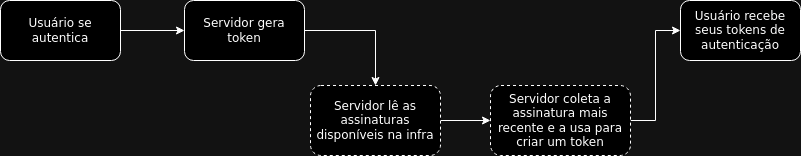
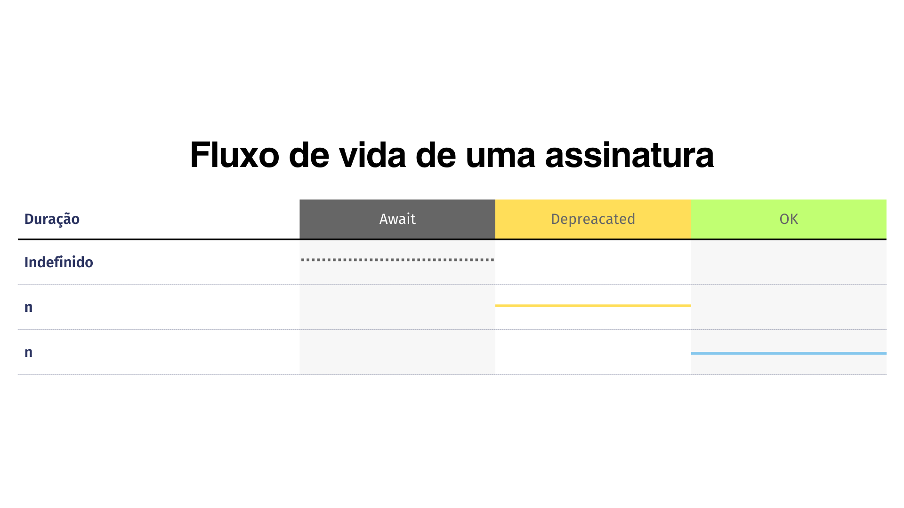
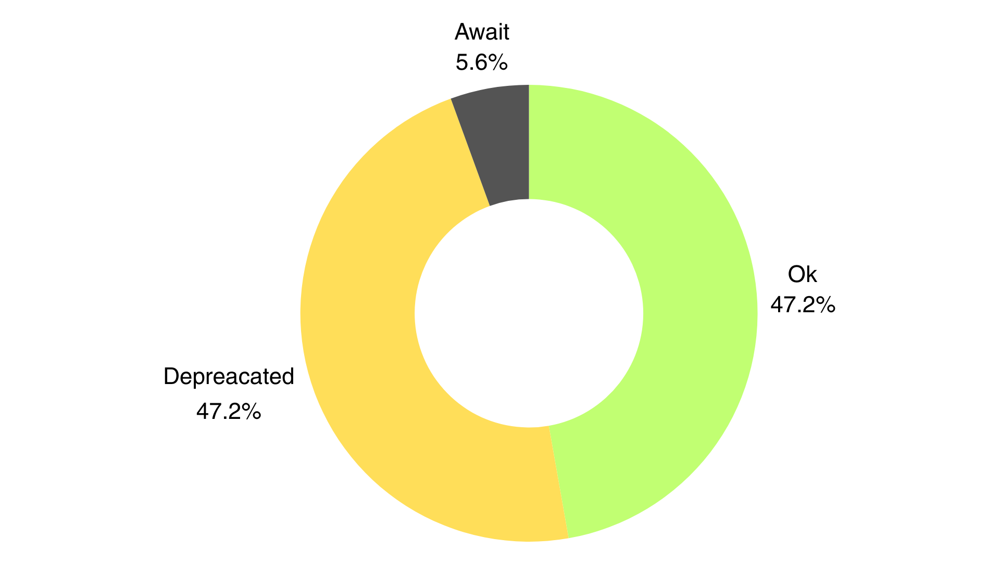

# Morada App - Auth Gateway

## Sobre a FaaS
O Auth Gateway é um sistema construindo com o intuito de ser implantado no GCP em forma de Cloud Functions, servindo como um proxy reverso para validar as comunicações externas e redireciona-las até os serviços solicitados.

## Dependências
- Zipkin: sistema de gestão de monitoramento dos traces;
- Cloud Functions: serviço do GCP feito para implantação de functions as a service;
- Firestore: usado no algoritmo de autenticação de gestão de redirecionamento de rotas
- Postgres: banco de dados relacional usado em ambiente de desenvolvimento
- CockroachDB: banco de dados relacional usado em ambiente de produção

## Algoritmo de autenticação usado
O sistema de autenticação dos serviços do MoradaApp necesitam de um fluxo próprio, negando, por exemplo, o uso de serviços de nuvem já prontos para tal, isso ocorre devido os requisitos e critérios de segurança que a aplicação necessita, como por exemplo, a adição de um fluxo de vida para as assinaturas usadas nos JWT.

Adiante, para melhores compreensões, observe abaixo na figura 1 a interação com o usuário e na figura dois o tempo de vida de uma assinatura JWT nos sistemas do MoradaApp.

<p align="center">
    
</p>

<p align="center">
    
</p>

Como mostrado acima, o fluxo de vida de uma assinatura, comumente usada em tokens JWT tem três versões disponíveis, podendo ou não ter valores diferentes, cada uma das versões possui seus devidos propositos e são rotacionadas períodicamente conforme o necessário, observe abaixo suas descrições:
- Ok: esta versão de assinatura é utilizada para a criação de novos tokens no sistema, então, caso os servidores optem por criar um novo token JWT, ele sempre vai escolher as versões de estado 'Ok' para cada assinatura requisitada;
- Depreacated: esta versão de assinatura é utilizada para dar suporte a versões que estão marcadas para serem substituidas futuramente, impedindo assim, que usuários sejam desconectados abruptamente do sistema. Nenhum token considerado novo deve conter este tipo de assinatura em seus registros, caso contrário, pode acarretar em uma desconexão inesperada na próxima rotação de versão;
- Await: esta versão é a mesma que a depreacated, com a diferença de que seu prazo de validade já passou e o servidores ainda estão rotacionando as versões conforme o necessário, podendo assim, ser substituida a qualquer momento sem nenhuma aviso. Portanto, a existência desta versão se da pela possibilidade de possíveis atrasos na rotação de novas versões de assinaturas.

### Exemplos
Digamos que um token de acesso JWT deve ter um prazo de validade de 15 minutos, logo, conforme a tabela da figura 2, n deve ser 15 minutos. Portanto, se n é 15 minutos, o **prazo de rotação total** deve ser n*2 que se equivale a 30 minutos, desconsiderando atrasos. 

Nos primeiros 15 minutos uma versão A da assinatura JWT vai ser utilizada para assinar os tokens considerados novos. Após este prazo, o servidor continuará dando suporte para esta assinatura, porém não deve gerar novos tokens com a mesma, definindo a versão A com o estado de 'Depreacated' e criando a versão B em estado 'Ok' e usando a mesma para a criação de novos tokens.

Após mais 15 minutos, todos os tokens em estado 'Depreacated' atingem seu estado de validade máximo e o sistema define a versão A em estado de 'Await', onde será excluído em segundo plano assim que possível pelo banco de dados em questão. Por conseguinte, o fluxo se repete em um loop indefinido de tempo.

<p align="center">
    
</p>

Por conseguinte, supondo que a infraestrutura tem um delay de 2 minutos para ativar a rotação das chaves, isso significa que ao todo, a versão A teve, ao máximo 15 + 2 minutos no estado 'Ok' para gerar suas novas chaves para os usuários e mais 15 + 2 minutos para continuar dando suporte aos usuários que solicitaram tokens com a chave de versão A, equivalendo-se 47.2% de seu tempo de existência, nos piores casos. 

Por fim, a versão A foi jogada para deleção no estado de 'Await', possuindo um tempo de espera máximo de 2 minutos, o que se equivale a 5.6% de tempo da sua existência.

### Fórmulas

Ao todo, podemos obter as seguintes formulas:
- Rotação total: R<sub>t</sub> = n*2+d
- Rotação parcial: R<sub>p</sub> = n+d
- Delay: d = [C<sub>sch</sub> - (T<sub>atual</sub> - C<sub>0</sub>)] + N

Sendo que:
- N: ruído na comunicação que pode ser gerado devido a latência na comunicação e a cargas computacionais mais altas;
- d: representa o delay máximo esperado em uma infra que se utiliza do cloud schedule do GCP ou qualquer outro scheduler;
- T<sub>atual</sub>: tempo atual;
- R<sub>p</sub>: rotação parcial de uma versão, ou seja, se a versão X transicionar de 'Ok' para 'Depreacated';
- R<sub>t</sub>: rotação total de uma versão, ou seja, o ciclo inteiro de vida da mesma;
- C<sub>0</sub>: data em milisegundos da primeira execução do cloud scheduler;
- C<sub>sch</sub>: tempo de disparo do cloud scheduler, ou seja, se o serviço dispara de 2 em 2 minutos, este é o valor

Para maiores explicações, solicite o mapa de infraestrutura do MoradaApp.

## Como executar
Para executar esta function localmente, basta seguir os seguintes comandos:
```
docker compose up -d
```
```
docker compose exec app bash
```
```
pnpm seed
```
```
pnpm dev
```
Após gerar a seed, lembre-se de que o firestore está sendo executado localmente e armazenando os dados em memória. Portanto, toda vez que você desativar os containers, execute ```pnpm seed``` novamente.

Ao executar a seed, você vai ter em mãos no seu terminal um token JWT, use-o para acessar este proxy, que por padrão já possui um redirecionamento no endpoint /registryapi, na qual pode ser customizado na variável de ambiente 'URL_TO_REDIRECT', onde o seu valor vai resultar no redirecionamento que o endpoint /registryapi vai fazer, ou seja, se o valor for https://github.com, ao acessar o endpoint citado com o token, você vai ser jogado para o site do github.

Não se esqueça de ativar o husky com ```pnpm set-hooks``` para poder trabalhar com os git hooks.
